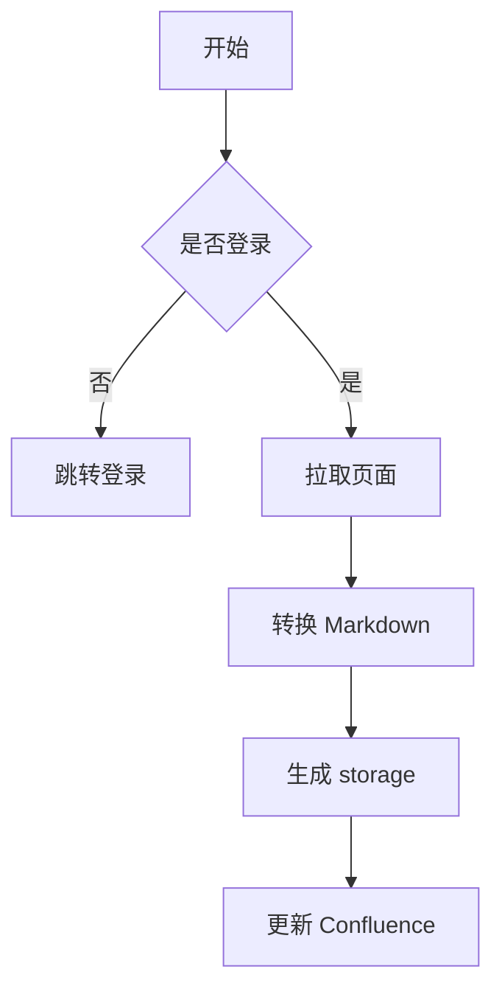
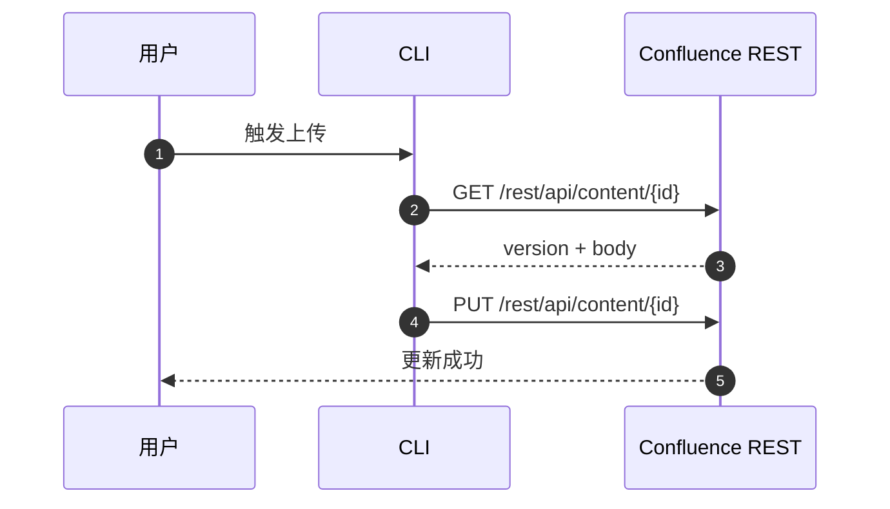
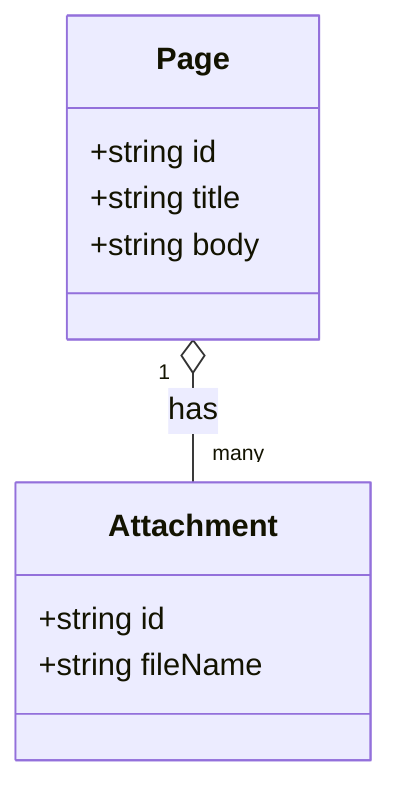
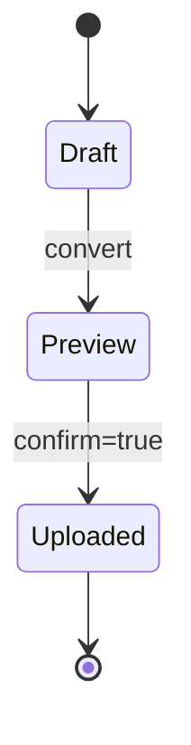

# 复杂文档示例

> 这个文件用于模拟 Confluence 上传预览，覆盖常见 Markdown 和多种 Mermaid 图。

## 一、流程图



## 二、时序图



## 三、类图



## 四、状态图



## 五、表格

| 功能 | 说明 | 备注 |
|---|---|---|
| 标题 | 一级标题 | 会转成 h1 |
| 列表 | 有序/无序 | 会保留层级 |
| 代码 | fenced code | 支持语言标记 |
| 图 | Mermaid / drawio | 重点模拟对象 |

## 六、列表

- 第一项
  - 子项 A
  - 子项 B
- 第二项
  1. 编号一
  2. 编号二

## 七、任务列表

- [x] 已完成
- [ ] 待处理

## 八、代码块

```ts
export function hello(name: string) {
  return `hello, ${name}`;
}
```

## 九、引用

> 这是一个引用块。

## 十、强调

**粗体**、*斜体*、`行内代码`、~~删除线~~。
